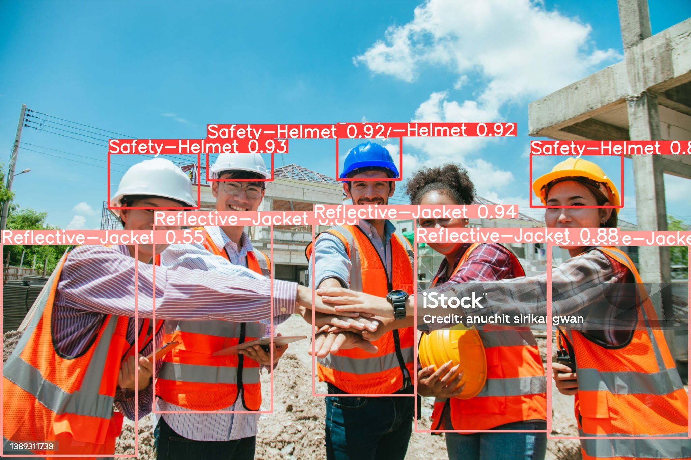

# Helmet Detection


## Giới thiệu

Dự án **Helmet Detection** là một ứng dụng phát hiện mũ bảo hiểm sử dụng công nghệ học máy. Mục tiêu của dự án là nhận diện xem người dùng có đội mũ bảo hiểm hay không, từ đó nâng cao an toàn trong lao động đặc biệt là ngành xây dựng công trình.

## Tính năng

- Phát hiện mũ bảo hiểm trong thời gian thực
- Tích hợp với webcam hoặc video từ camera

## Yêu cầu

- Python 3.9.19
- Yolov10
- Các thư viện cần thiết khác (xem phần Cài đặt)

## Cài đặt

1. **Clone repository:**

   ```bash
   git clone https://github.com/LeThang15081994/_HelmetDection.git
   cd _HelmetDection
2. **Install libary:**
   ``` bash
   pip install -r requirements.txt
   pip install -e .
   pip3 install torch torchvision torchaudio --index-url https://download.pytorch.org/whl/cu118
   
## Huấn luyện mô hình

Sử dụng Yolov10 để huấn luyện tập dữ liệu custom, bạn có thể sử dụng đoạn mã dưới đây:

```python
from ultralytics import YOLOv10

# Khởi tạo mô hình
model = YOLOv10('yolov10s.pt')

# Đường dẫn đến dữ liệu huấn luyện
data_path = './safety-Helmet-Reflective-Jacket/data_helmet.yaml'  # Cập nhật với đường dẫn của bạn
img_size = 640  # Kích thước hình ảnh đầu vào
epochs_size = 25     # Số lượng epoch để huấn luyện
batch_size = 16      # kich thước batch size

# Huấn luyện mô hình
 model.train(data=path_yaml,
                epochs = epochs_size,
                imgsz = img_size,
                batch = batch_size,
                device = 'cuda') # device chon chạy trên GPU hoặc CPU.
```

## Validation
Để thực hiện Validation trên hình ảnh bằng mô hình YOLOv10, bạn có thể sử dụng đoạn mã Python sau đây:

```python
path_model = './yolov10/runs/detect/train/weights/best.pt'
path_yaml = './safety-Helmet-Reflective-Jacket/data_helmet.yaml'
batch_size = 16
img_size = 640
devices = torch.device('cuda' if torch.cuda.is_available() else 'cpu')
#Load model
model = YOLOv10(path_model)

model.val(data=path_yaml,
          batch = batch_size,
          imgsz = img_size,
          device = devices,
          split='test')
```

## Dự Đoán Hình Ảnh.
Để thực hiện dự đoán trên hình ảnh bằng mô hình YOLOv10, bạn có thể sử dụng đoạn mã Python sau đây:

```python
# Config
model = YOLOv10('./yolov10/runs/detect/train/weights/best.pt')
img_size = 640

# Dự đoán
results = model.predict(source="./testImg.jpg", 
                       imgsz=img_size,
                       save=True, 
                       conf=0.40)

# Vẽ kết quả trên hình ảnh
img = results[0].plot()  # Lấy hình ảnh đầu tiên từ kết quả
cv2.imshow("Predicted Image", img)
cv2.waitKey(0)
cv2.destroyAllWindows()
```
# Kết Quả Dự Đoán
Hình ảnh đầu vào:


Hình ảnh dự đoán từ mô hình:


